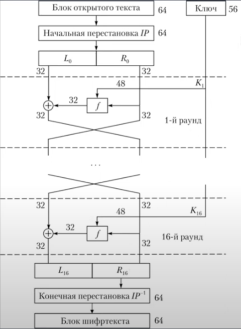
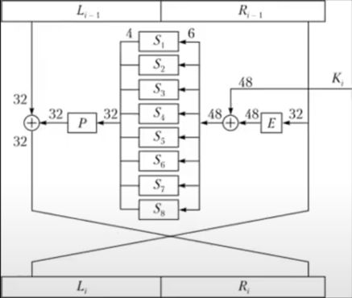
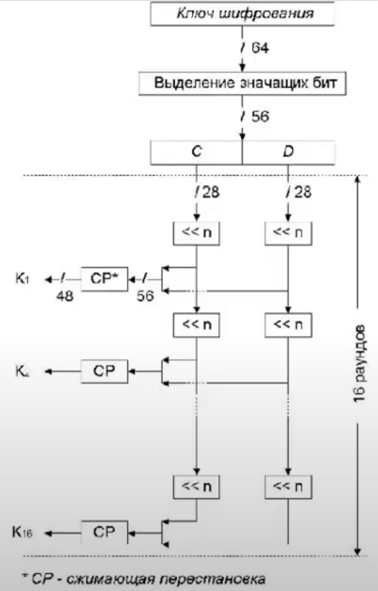

# Data Encryption Standard (DES)

Данный алгоритм реализован на языке **Python**

## Описание алгоритма

**Data Encryption Standard (DES)** — это симметричный алгоритм шифрования, который использует 56-битный ключ для защиты данных. 
Он был разработан в 1970-х годах и стал стандартом шифрования в США в 1977 году. 
Несмотря на его широкое применение, DES считается устаревшим из-за относительно низкой безопасности, и его использование было заменено более современными алгоритмами, такими как AES (Advanced Encryption Standard).

## Алгоритм

### Основные характеристики:

- **Тип шифрования**: Симметричное (один и тот же ключ используется для шифрования и дешифрования). 
- **Блок шифрования**: 64 бита (8 байт).
- **Ключ шифрования**: 56 бит (ключ фактически представлен как 64 бита, но 8 бит используются для контроля четности). 
- **Число раундов**: 16 раундов шифрования.

### Структура DES
- **Инициализация**: Входные данные проходят начальную перестановку (`IP`). 
- **16 раундов**: Каждый раунд состоит из:
  - Расширения (expansion) 32-битного блока до 48 бит. 
  - Применения функции `F`, которая использует `S`-боксы для подстановки.
  - XOR операции с 48-битным ключом.
  - Применения перестановки `P`. 
- **Обратная перестановка**: После завершения всех раундов выполняется обратная перестановка (`IP^-1`).

#### Схема алгоритма

#### Схема `f` функции

#### Схема расширения ключа

### Безопасность

DES был уязвим для атак с использованием полного перебора из-за ограниченной длины ключа (56 бит). 
Современные системы используют более надежные алгоритмы, такие как AES, или увеличивают длину ключа (например, Triple DES).
